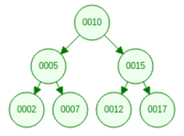

#White Boarding Binary Search Tree Traversals

Assume for these questions that you have a fully functional binary search tree without the corresponding methods that will be requested.

For review on binary search trees you can look at the following slides on this [link](https://docs.google.com/presentation/d/1ptcyCcpCeCRtoLmR-GdsRttKr7JFTtcomcYLtkOLL3c/edit?usp=sharing).

You're node class will look like the following:

```javascript

class Node {
    constructor(value) {
        this.value = value;
        this.parent = this.left = this.right = null;
    }
}

```

##Question 1:

Write an algorithm for performing breadth-first search of a given binary search tree. Assume the binary search property is not broken at any point in the tree. Each node is guaranteed to have a parent, left, right, and value property (though they may be null). You will need to use a Queue data structure using the following methods: enqueue(item) and dequeue(). Enqueue puts an item at the back of the queue and dequeue removed item from the front of the queue and returns it. Below is the sample input and starter code:

###Sample input:

<div>
    
</div>

###Sample output:

10, 5, 15, 2, 7, 12, 17

###Starter Code:

```javascript

breadthFirst() {
    if (!this.root) return;
    const queue = new Queue();
    // insert your code here :)
};

```

##Question 2:

Write an algorithm for performing depth-first search of a given binary search tree. Asume the binary search property is not broken at any point in the tree. Each node is guaranteed to have a parent, left, right, and value property (though they may be null). You will need to use a Stack data structure (you get to cheat with JavaScript by just using an array) with the following methods: push(item) and pop(). Push puts an item at the top of the stack and pop removes the top item from the stack and returns it. Below is the sample input and starter code:

###Sample input:

<div>
    
</div>

###Sample output:

2, 5, 7, 10, 12, 15, 17

###Starter Code:

```javascript

depthFirst() {
    if (!this.root) return;
    const stack = [];
    // insert your code here :)
}

```